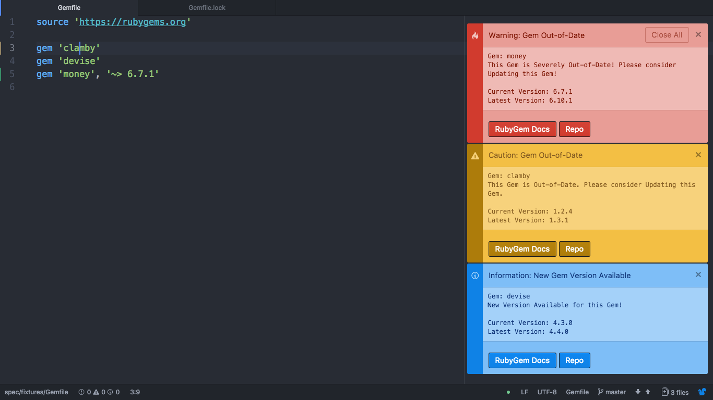

# Gem-Checker { Prototype: Phase 1 }

---

Gem-Checker is a package designed to provide Ruby on Rails developers with information and version alert notifications regarding RubyGems.

All functions provided by this package are only able to be activated while viewing the Gemfile for your Ruby on Rails application.

## Introduction
Developed as a Final Year Project while studying for a degree in Computer Science at the University of Portsmouth, England.

This package hopes to improve the user experience of Ruby of Rails Developers, by generating a variety of notifications alerting developers to the details, version updates and suggested maintenance of RubyGems installed on their applications.

## Features - Phase 1: Notifications
### Cursor Functions
#### Gem Details
Generate an Information Notification regarding the details of a specific RubyGem. The RubyGem is selected by the current placement of your cursor on the Gemfile.

###### Display
* Gem Name - Name of the selected RubyGem.
* Gem Description - A detailed descript of the selected RubyGem's functionality, retrieved from https://rubygems.org/.
* Current Version - The current version of the selected RubyGem installed on your Ruby on Rails application.
* Latest Version - The latest version of RubyGem retrieved from https://rubygems.org/.

#### Check Gem Maintenance
RubyGems are often badly maintained, which can cause a variety of issues when updating to newer versions of Rails.

To help indicate these issues, this function takes a selected RubyGem and determines whether or not it has released a new version within the last 6 months.
If the latest version of the selected gem exceeds 6 months then a Warning Notification is generated alerting the developer to the issue.

###### Display
* Gem Name - Name of the selected RubyGem
* Warning Description - Sentence detailing the date that the latest version was released.

### Gemfile Functions
#### Check All Gemfile Gem Versions
One of the main issues regards RubyGems is keeping them up to date with the latest version once they have been installed onto your package.

This function reads the entire Gemfile of your Ruby on Rails application and determines whether or not the your current version of each Gem is the latest version.

###### Display
Depending on the functions finding different Notification Alerts are generated:

* Current Version is 1 version behind the Latest Version
  - Information Notification
  - Gem Name - Name of the selected RubyGem.
  - Warning Sentence - Indicates a new version of this gem is available.
  - Current Version - The current version of the selected RubyGem installed on your Ruby on Rails application.
  - Latest Version - The latest version of RubyGem retrieved from https://rubygems.org/.

* Current Version is between 2 - 4 Versions behind the Latest Version
  - Warning Notification
  - Gem Name - Name of the selected RubyGem.
  - Warning Sentence - Indicates your currently installed version of this gem is out of date.
  - Current Version - The current version of the selected RubyGem installed on your Ruby on Rails application.
  - Latest Version - The latest version of RubyGem retrieved from https://rubygems.org/.

* Current Version is 5 or more Versions behind the Latest Version
  - Warning Notification
  - Gem Name - Name of the selected RubyGem.
  - Warning Sentence - Indicates your currently installed version of this gem is severally out of date.
  - Current Version - The current version of the selected RubyGem installed on your Ruby on Rails application.
  - Latest Version - The latest version of RubyGem retrieved from https://rubygems.org/.

###### Common Display
* Buttons
  - RubyGem Doc - Opens a browser window directly to the RubyGem Documentation of the specified gem on https://rubygems.org/.
  - Repo - Opens a browser window directly to the GitHub repo of the specified on https://github.com/.

## Evaluation
As this package is part of a developing final year project it is important to gather evidence and evaluation of my package being used and tested.

With this in mind, can I ask all user of this package to fill out a short survey of no more that 5 quick questions.

Survey URL:
https://www.surveymonkey.co.uk/r/CFSDRF7

I thank you all in advance for your input and hope that your feedback will help to improve and further develop this project over the coming months.

